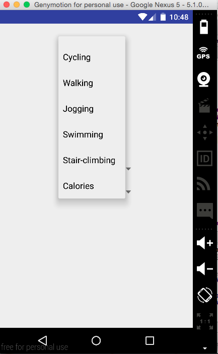
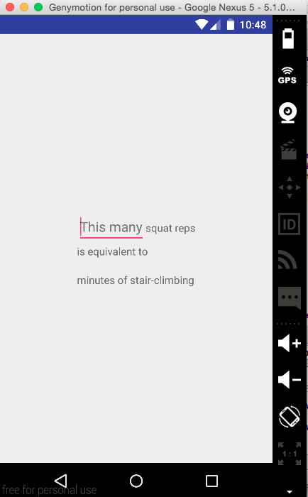
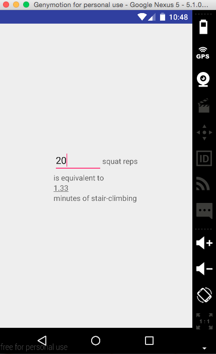

# PROG 01: Crunch Time

I wanted to create an app that could be used by an athlete / anyone trying to build a fitness plan. As such, the main functionality of the app was to design a schedule that one would want to use. The most important features of such an app would have you comparing different activities to see how they compare, and which activity you want to include on different days. In order to think this through to completion, I thought of calories as essentially being another activity that one could carry out - hence, how many push-ups is equivalent to X calories, is equivalent statement/question to: how many push-ups is equivalent to X pull-ups. They are equally important in the framing that I had for the app, and hence calories was just another element in the spinner, it was not a special button in and of itself.

The app basically works as follows: it opens on the main page of the app, where the user picks two different activities to convert between. On picking the second activity, he is automatically taken to the second page of the app where he can test different values to convert between. This is split up as such, because if the main purpose is to design a daily calorie burning routine, then your main focus is to see how many reps/minutes of a certain activity do you need to carry out to get the same as yesterdays calorie count burnt.

The main screen is composed of two spinners. From these you choose the two activities that you want to convert between (including calories). This takes you to the second screen, as seen in the screenshots, which includes one input field, and text. The input field is a numerical input field where you input a number of reps/minutes of exercise, or desirec calorie count, and it will run the automatic conversion for you.

## Authors

Nicholas Hardison-Moschopoulos ([mosnicholas@berkeley.edu](mailto:mosnicholas@berkeley.edu))

## Demo Video

See [your demo video title here] (https://youtube.com)

## Screenshots

## Acknowledgments
